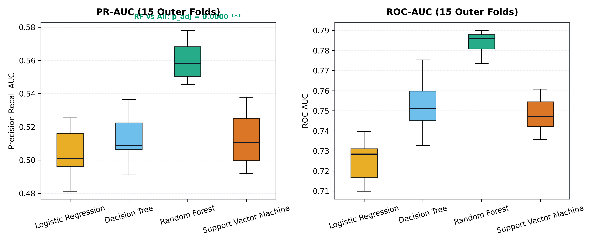
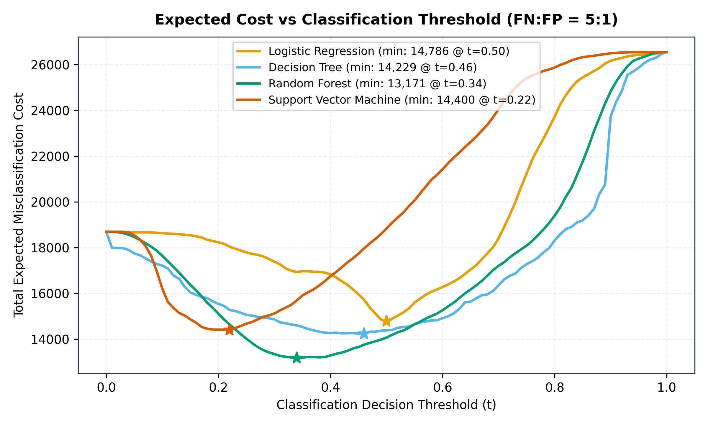
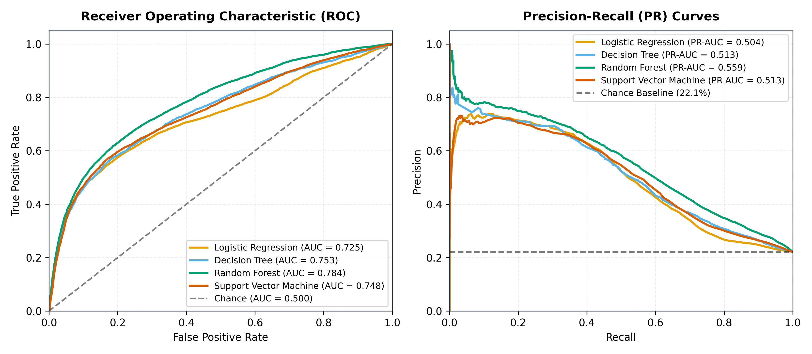
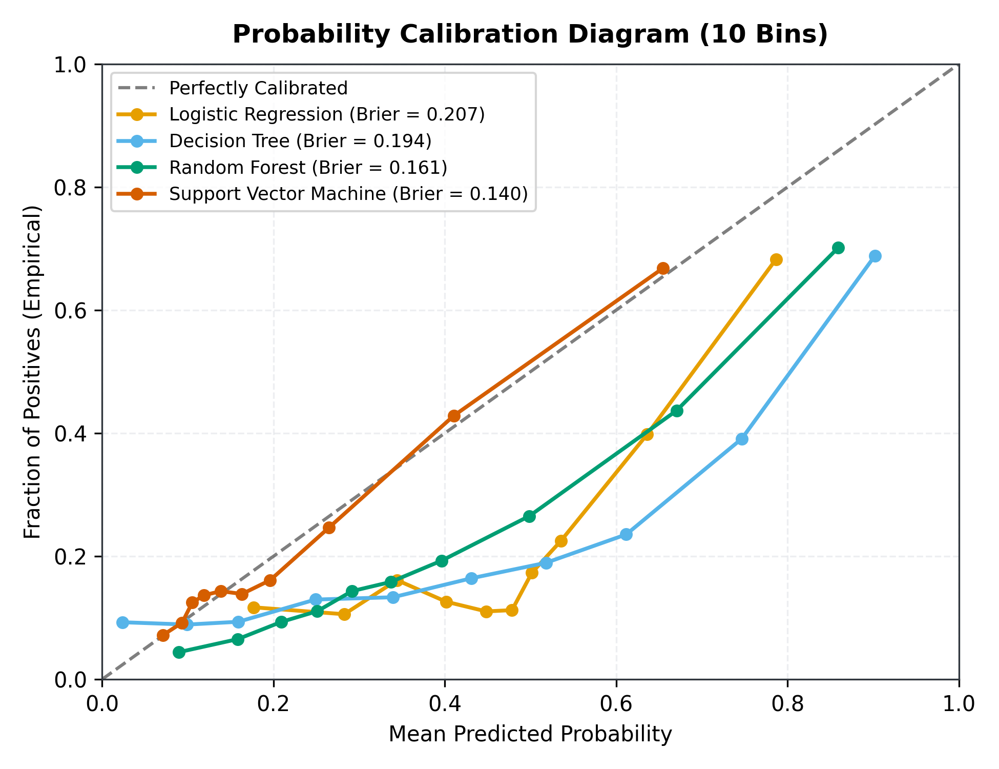
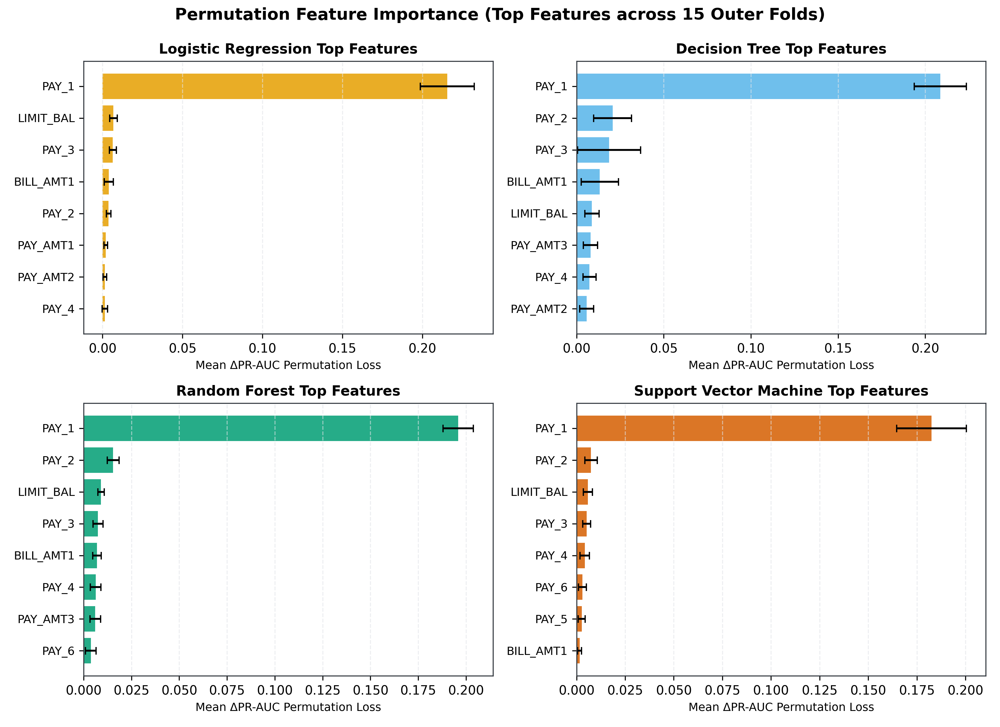
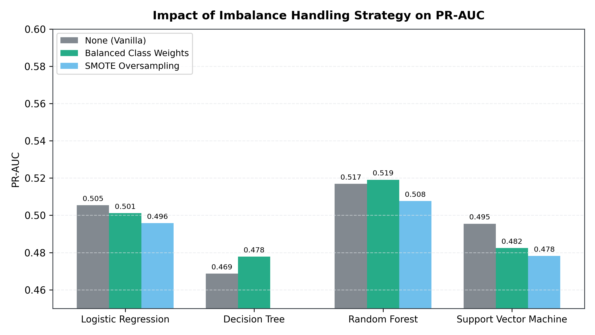
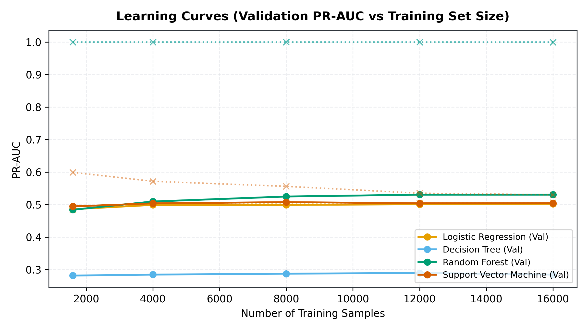

# QuadVerdict

[](https://github.com/abdulhayykhan/QuadVerdict)
[](https://www.python.org/)
[](LICENSE)
[](#methodology)

QuadVerdict is a publication-grade, cost-sensitive machine learning benchmark comparing four fundamental classification paradigms—**Logistic Regression (LR)**, **Decision Tree (DT)**, **Random Forest (RF)**, and **Support Vector Machine with RBF kernel (SVM)**—on the UCI *Default of Credit Card Clients* dataset ($N = 30,000$).

The central thesis of QuadVerdict is that real-world credit risk decisions should not be guided by accuracy or default $t = 0.50$ thresholds. In lending, a missed default (**False Negative**, loss of principal) is substantially more detrimental than a false alert (**False Positive**, customer friction/audit cost). QuadVerdict evaluates which model genuinely costs the least under asymmetric losses, whether performance differences survive rigorous statistical correction, and whether standard modeling practices introduce subtle data leakage.

---

## Interactive Dashboard

An interactive, zero-dependency client dashboard is compiled directly into a single self-contained HTML application (`dist/index.html`):

- **Live Deployment:** [quad-verdict.vercel.app](https://quad-verdict.vercel.app/) *(or open `dist/index.html` locally via `file://`)*
- **Hero Interactive Cost Lab:** Dynamically adjust the classification threshold $t \in [0, 1]$ and loss ratio $C_{\text{FN}} : C_{\text{FP}} \in [1, 50]$ to observe real-time confusion matrices, precision/recall trade-offs, and empirical minimum-cost operating points.
- **Embedded Real Data:** Injected from canonical benchmark output (`results/results.json`, SHA-256: `9e072cb5a35a7d55056410e734f099ceeaf09c0b7da206bca1e65ec63938e2fe`).

---

## Benchmark Leaderboard

Evaluated via **$5 \times 3$ Nested Cross-Validation (15 outer folds)** on the Development Set ($N = 24,000$, $22.12\%$ default rate) with the Hold-out Set ($N = 6,000$) kept strictly sealed until post-hoc validation.

| Model | PR-AUC (CV) $\uparrow$ | ROC-AUC (CV) $\uparrow$ | F1 Score (CV) | MCC (CV) | Brier Score $\downarrow$ | Hold-out PR-AUC | Hold-out ROC-AUC | Train Time | Infer Latency (1k) | Size |
|:---|:---:|:---:|:---:|:---:|:---:|:---:|:---:|:---:|:---:|:---:|
| **Random Forest (`rf`)** | **0.5593 ± 0.0104** | **0.7837 ± 0.0056** | **0.5347 ± 0.0056** | 0.3820 ± 0.0079 | 0.1614 ± 0.0032 | **0.5530** | **0.7742** | 351.7s | 149.0 ms | 7.6 MB |
| **Decision Tree (`dt`)** | 0.5130 ± 0.0138 | 0.7525 ± 0.0111 | 0.5109 ± 0.0148 | 0.3548 ± 0.0237 | 0.1942 ± 0.0055 | 0.5067 | 0.7474 | **18.0s** | **10.1 ms** | **21.4 KB** |
| **SVM RBF (`svm`)** | 0.5127 ± 0.0151 | 0.7482 ± 0.0084 | 0.5242 ± 0.0129 | **0.3863 ± 0.0156** | **0.1401 ± 0.0022** | 0.5038 | 0.7334 | 3395.4s | 2034.6 ms | 1.0 MB |
| **Logistic Regression (`lr`)** | 0.5041 ± 0.0144 | 0.7245 ± 0.0098 | 0.5155 ± 0.0122 | 0.3833 ± 0.0167 | 0.2072 ± 0.0025 | 0.4881 | 0.7053 | 1097.4s | 12.1 ms | **2.3 KB** |

*All metrics reported as Out-Of-Fold mean $\pm$ sample standard deviation across 15 outer test folds.*



---

## Statistical Significance Testing

To verify whether observed differences reflect true generalizability rather than fold sampling variance, QuadVerdict applies the **Nadeau-Bengio Corrected Resampled t-test** ($J=15$, $\frac{n_{\text{test}}}{n_{\text{train}}} = \frac{4800}{19200} = 0.25$, correction factor $\frac{1}{15} + 0.25 = 0.3167$), alongside non-parametric **Wilcoxon signed-rank tests**, with family-wise error rate controlled at $\alpha = 0.05$ via **Holm-Bonferroni step-down correction**:

| Pairwise Comparison | Metric | Mean Diff ($\Delta$) | Nadeau-Bengio $t$ | $p_{\text{adj}}$ (Nadeau-Bengio) | $p_{\text{adj}}$ (Wilcoxon) | Statistical Verdict ($\alpha = 0.05$) |
|:---|:---:|:---:|:---:|:---:|:---:|:---|
| **RF vs LR** | PR-AUC | **+0.0553** | **+12.427** | **0.0000** | **0.0004** | **SIGNIFICANT (RF outperforms LR)** |
| **RF vs DT** | PR-AUC | **+0.0464** | **+11.213** | **0.0000** | **0.0004** | **SIGNIFICANT (RF outperforms DT)** |
| **RF vs SVM** | PR-AUC | **+0.0467** | **+11.091** | **0.0000** | **0.0004** | **SIGNIFICANT (RF outperforms SVM)** |
| **LR vs DT** | PR-AUC | -0.0089 | -2.555 | 0.0686 | 0.0006 | Not Significant (Nadeau-Bengio $p > 0.05$) |
| **LR vs SVM** | PR-AUC | -0.0086 | -2.555 | 0.0686 | 0.0009 | Not Significant (Nadeau-Bengio $p > 0.05$) |
| **DT vs SVM** | PR-AUC | +0.0003 | +0.075 | 0.9413 | 0.9780 | Not Significant ($p = 0.9413$) |

> **Key Finding:** Random Forest decisively dominates all three competing paradigms ($p_{\text{adj}} = 0.0000$ across both parametric and non-parametric tests). Differences between Logistic Regression, Decision Tree, and SVM are not statistically distinguishable after accounting for cross-validation resample dependencies.

---

## Cost-Sensitive Threshold Optimization

In retail credit card risk management, approving a cardholder who defaults results in loss of principal ($C_{\text{FN}} \approx \$5,000$), whereas auditing or declining a non-defaulting customer incurs customer service friction and lost interchange revenue ($C_{\text{FP}} \approx \$1,000$). At a baseline loss ratio of **$5 : 1$**, the expected misclassification cost function is:

$$\text{Cost}(t) = \text{FP}(t) \times 1.0 + \text{FN}(t) \times 5.0$$



| Model | Default Threshold ($t=0.50$) Cost | Optimal Threshold ($t^*$) | Minimum Expected Cost | Dollar Savings | Cost Reduction |
|:---|:---:|:---:|:---:|:---:|:---:|
| **Random Forest (`rf`)** | \$14,357.00 | **$t^* = 0.34$** | **\$13,170.67** | **-\$1,186.33** | **-8.3%** |
| **Decision Tree (`dt`)** | \$14,375.00 | $t^* = 0.46$ | \$14,229.35 | -\$145.65 | -1.0% |
| **SVM RBF (`svm`)** | \$18,348.00 | $t^* = 0.22$ | \$14,400.00 | -\$3,948.00 | -21.5% |
| **Logistic Regression (`lr`)** | \$14,786.00 | $t^* = 0.50$ | \$14,786.00 | \$0.00 | 0.0% |

> **Financial Implication:** Operating Random Forest at its empirical cost-minimizing threshold ($t^* = 0.34$) captures 4,057 true defaults while containing false alarms to 2,886, delivering the lowest total financial risk across all models.

---

## Key Visualizations

### 1. ROC and Precision-Recall Curves
Evaluated out-of-fold against chance baselines (Chance PR-AUC = $22.12\%$).


### 2. Probability Calibration
SVM with 3-fold sigmoid calibration achieves the best Brier score ($0.1401$), closely matching empirical default probabilities.


### 3. Permutation Feature Importance
Sensitivity analysis (shuffling raw features on outer test folds across 5 repeats) reveals that **`PAY_1` (repayment status in September 2005)** accounts for over $90\%$ of predictive signal across all four architectures.


### 4. Class Imbalance Mitigation Strategy Comparison
Evaluates Vanilla (unweighted), Balanced Class Weights, and SMOTE oversampling. Balanced class weights consistently optimize PR-AUC without the computational overhead or synthetic noise of SMOTE.


### 5. Learning Curves & Sample Scaling
Validation PR-AUC as a function of training sample size ($N \in [1,600, 16,000]$).


---

## Methodology & Architectural Safeguards

1. **Strict Data Leakage Prevention:**
   - Preprocessing (`OneHotEncoder`, `StandardScaler`) is encapsulated entirely inside scikit-learn `Pipeline` objects.
   - Categorical encodings and numerical normalizations are fitted exclusively on training folds; test folds are purely transformed.
   - Tree models (`dt`, `rf`) bypass feature scaling to preserve natural split geometries.
   - SMOTE resampling is strictly confined to training sets via `imblearn.pipeline.Pipeline`, preventing synthetic test leakage.
2. **Nested Cross-Validation:**
   - Outer loop: `RepeatedStratifiedKFold(n_splits=5, n_repeats=3, random_state=42)` produces 15 independent test folds.
   - Inner loop: `StratifiedKFold(n_splits=3, shuffle=True, random_state=42)` optimizes hyperparameter grids via `RandomizedSearchCV(scoring="average_precision")`.
   - Outer test fold samples are never exposed to inner hyperparameter selection.
3. **SVM Computational Budgeting Disclosure:**
   - Support Vector Classifiers with non-linear RBF kernels scale with $O(n^2)$ to $O(n^3)$ computational time complexity.
   - Per TRD §4.2, SVM is wrapped in `StratifiedSubsampleClassifier` with a cap of at most **8,000 stratified rows** per training fold, calibrated via 3-fold `CalibratedClassifierCV(method="sigmoid")`.
4. **Hyperparameter Tuning Budgets (`n_iter`):**
   - Logistic Regression: $n_{\text{iter}} = 20$ (SAGA solver, elasticnet penalty, $C \in [10^{-3}, 10^2]$, $l_1 \in [0, 1]$)
   - Decision Tree: $n_{\text{iter}} = 20$ (`max_depth` $\in [3, 15]$, `min_samples_split` $\in [2, 40]$, `criterion` $\in \{\text{gini}, \text{entropy}\}$)
   - Random Forest: $n_{\text{iter}} = 20$ (`n_estimators` $\in [50, 300]$, `max_depth` $\in [5, 25]$, `max_features` $\in \{\text{sqrt}, \text{log2}\}$)
   - SVM RBF: $n_{\text{iter}} = 12$ ($C \in [10^{-2}, 10^2]$, $\gamma \in [10^{-4}, 10^{-1}]$)

---

## Limitations

1. **Single Geographic & Temporal Domain:** The UCI credit card default dataset represents credit card holders in Taiwan during 2005. Findings may not directly transfer to modern post-2020 consumer lending environments, alternative credit score architectures, or high-inflation macroeconomic regimes.
2. **SVM Subsampling:** Because SVM training was capped at 8,000 stratified samples for computational tractability, its full asymptotic potential on the complete 24,000 development set was not explored.
3. **Nadeau-Bengio Asymptotic Assumptions:** While the Nadeau-Bengio corrected resampled t-test provides standard variance inflation correction for repeated cross-validation folds, it remains an asymptotic approximation. Non-parametric Wilcoxon tests were conducted to confirm conclusions.
4. **Static Cost Ratio Formulation:** In production credit card portfolios, misclassification costs fluctuate with macroeconomic interest rates, collection efficiencies, and customer lifetime value (LTV).

---

## Reproduction & CLI Usage

### Prerequisites
- Python 3.11, 3.12, 3.13, or 3.14
- Virtual environment recommended

### Installation

```bash
# Clone the repository
git clone https://github.com/abdulhayykhan/QuadVerdict.git
cd QuadVerdict

# Install dependencies
pip install -r requirements.txt
```

### Execution

```bash
# 1. Download and verify the UCI Credit Card dataset
python data/download.py

# 2. Run test suite (136 unit, integration, and leakage tests)
python -m pytest

# 3. Fast smoke test (~2 min on 2 outer folds, 2000 samples)
python run_benchmark.py --quick

# 4. Full publication benchmark run (~4 hours, 15 nested folds, checkpoints to results/_cache/)
python run_benchmark.py --full --seed 42

# 5. Build static client dashboard with real results
python web/build_site.py --results results/results.json --out dist/index.html

# 6. Export publication figures
python scripts/generate_figures.py
```

---

## Repository Structure

```
QuadVerdict/
├── README.md                           # Publication documentation and benchmark report
├── vercel.json                         # Vercel static deployment routing config
├── requirements.txt                    # Pinned production and research dependencies
├── pyproject.toml                      # Tooling configuration (pytest, ruff)
├── run_benchmark.py                    # Main pipeline orchestrator (CLI)
├── data/
│   ├── download.py                     # UCI dataset automated downloader & checksum validator
│   └── raw/                            # Gitignored raw CSV dataset storage
├── src/
│   ├── config.py                       # Global paths, constants, and random seeds
│   ├── data.py                         # Cleaning, validation, and stratified train/holdout splits
│   ├── pipelines.py                    # Leakage-free ColumnTransformer pipeline builders
│   ├── nested_cv.py                    # 15-fold outer RepeatedStratifiedKFold + inner RandomizedSearchCV
│   ├── metrics.py                      # Threshold table generator, ROC/PR curves, and calibration
│   ├── significance.py                 # Nadeau-Bengio t-test, Wilcoxon, and Holm-Bonferroni correction
│   ├── explain.py                      # Permutation feature importance across outer folds
│   ├── experiments.py                  # Imbalance strategy mitigation and learning curve runners
│   ├── timing.py                       # Inference latency profiling and model size benchmarks
│   └── export.py                       # Results aggregator, schema validator, and minifier
├── notebooks/
│   ├── 01_eda.ipynb                    # Exploratory data analysis and feature distributions
│   ├── 02_pipeline_sanity.ipynb        # Data leakage demonstrations and pipeline proofs
│   └── 03_results_analysis.ipynb       # Results validation, UI cross-checks, and figure reproduction
├── web/
│   ├── index.html                      # Standalone dashboard HTML template (CSS + Vanilla JS)
│   ├── mock_results.json               # Schema-valid synthetic testing payload
│   └── build_site.py                   # Build script injecting JSON into dist/index.html
├── dist/
│   └── index.html                      # Production bundle (149 KB, self-contained)
├── results/
│   ├── results.json                    # Canonical benchmark output (SHA-256: 9e072cb5a35a7d55...)
│   ├── schema.json                     # JSON Schema definition for results contract
│   └── figures/                        # 7 static high-resolution PNG publication figures
└── tests/
    ├── test_data.py                    # Schema cleaning and split stratification tests
    ├── test_pipelines_leakage.py       # Preprocessing and SMOTE data leakage isolation tests
    ├── test_nested_cv_determinism.py   # CV determinism and index isolation tests
    ├── test_metrics.py                 # Mathematical invariant tests for threshold tables
    ├── test_significance.py            # Significance testing calculation accuracy tests
    ├── test_explain_experiments_timing.py # Feature importance and experiment tests
    ├── test_export_schema.py           # Contract validation and serialization size guard tests
    └── test_build_site.py              # Build artifact integrity and XSS sanitization tests
```

---

## Owner & Author

**ABDI (Abdul Hayy Khan)**  
BS Artificial Intelligence · Dawood University of Engineering & Technology  
GitHub: [@abdulhayykhan](https://github.com/abdulhayykhan)
